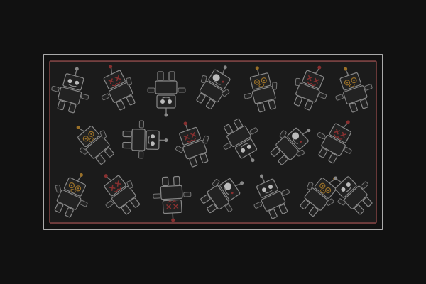
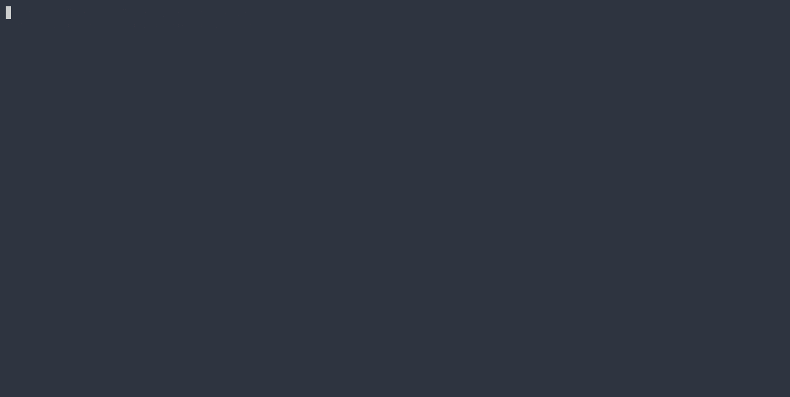

<div align="center">
  
</div>

# agentbox

[](https://github.com/julianthome/agentbox/actions/workflows/ci.yml)

A Docker sandbox for running the [pi](https://pi.dev) coding agent with [Ollama](https://ollama.com) as a local provider, in a polished, pre-configured terminal environment. [opencode](https://opencode.ai) is also supported.

## What's inside

- Two harnesses: `pi` (default) or `opencode`, selected at launch via `AGENT=`
- tmux: session with an agent window and a shell window
- Shell environment: oh-my-zsh + Powerlevel10k lean theme + FiraCode Nerd Font
- Ollama auto-discovery: models pulled from your host are wired in automatically
- Config persistence: agent settings, auth, and themes survive container restarts via `~/.agentbox/`
- Custom pi theme: `pi-dev-dark`, tuned to the pi.dev colour palette
- Session branching: creates a `agentbox/<branch>/<timestamp>` git branch before the agent starts so changes are always reviewable

## Requirements

- Docker with Docker Compose (`docker compose` or `docker-compose`)
- A [Nerd Font](https://www.nerdfonts.com/) set in your terminal (FiraCode recommended)
- Ollama on the host for local models — start it with `OLLAMA_HOST=0.0.0.0 ollama serve`

## Quick start

**1. Build the image**

```sh
make build
```

Always fetches the latest versions of all agents and base image. Run this whenever you want to upgrade.

**2. Configure your workspace**

Edit `compose.yml` and add the directories you want the agent to work with under `volumes`:

```yaml
volumes:
  - ${HOME}/.agentbox/pi:/home/user/.pi
  - ${HOME}/.agentbox/opencode/config:/home/user/.config/opencode
  - ${HOME}/.agentbox/opencode/local:/home/user/.local/share/opencode
  - ../myproject:/workspace/myproject
  - ../other project:/workspace/other project
```

Each directory appears as a subdirectory of `/workspace` inside the container. Paths with spaces work fine.

**3. Run**

```sh
make run                  # launch pi
make run AGENT=opencode   # launch opencode instead
make run SNAPSHOT=0       # skip session branching
make shell                # drop into a zsh shell without starting an agent
```

Each run starts a tmux session with two windows — one running the agent, one with a plain shell. Agent config and auth are persisted to `~/.agentbox/` on the host so settings survive between runs.

## Custom packages

To add your own packages on top of the base image, copy the template and edit it:

```sh
cp Dockerfile.custom.example Dockerfile.custom
```

Add your `apk`, `pip`, or `npm` installs:

```dockerfile
FROM agentbox:latest
USER root
RUN apk add --no-cache htop httpie
RUN pip3 install --no-cache-dir requests
RUN npm install -g typescript
USER user
```

`make build` detects `Dockerfile.custom` automatically, layers it on top of the freshly built base, and retags the result as `agentbox:latest`. The file is gitignored so your customisations stay local.

## Session branching

Before the agent starts, agentbox creates a timestamped git branch (`agentbox/<branch>/<timestamp>`) in each mounted git repository. This lets you review exactly what the agent changed and discard or merge at will. Set `SNAPSHOT=0` to disable.

## Ollama

If Ollama is running on the host, agentbox discovers it automatically and wires its models into the agent config. Start Ollama with:

```sh
OLLAMA_HOST=0.0.0.0 ollama serve
```

The `0.0.0.0` binding is required so the container can reach it via `host.docker.internal`.

## Demo

<div align="center">
  
</div>
